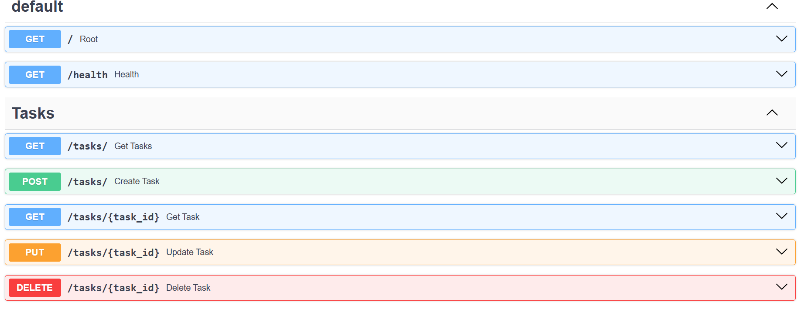

# FastAPI CRUD API
A simple Todo API built with FastAPI, now refactored to use SQLite for data storage.

## SQLite Database
This project uses Python's built-in `sqlite3` library to persist tasks. The database is automatically initialized when the server starts.

**Database File Location:** `app/database/tasks.db`

### Database Screenshot


### Example SQL Query
```sql
SELECT * FROM tasks WHERE done = 1;
```

## Requirements
- Python 3.9+
- FastAPI
- Uvicorn
- Pytest

## Installation Instructions
1. Clone the repository
2. Create a virtual environment: `python -m venv venv`
3. Activate the virtual environment
4. Install dependencies: `pip install -r requirements.txt`

## Run Instructions
Run the server using uvicorn:
```bash
uvicorn app.main:app --reload
```
The API will be available at `http://127.0.0.1:8000`.

## API Documentation (Swagger UI)
Interactive API documentation is available at `http://127.0.0.1:8000/docs`.



## Testing
Run the tests using pytest:
```bash
pytest tests
```
# Todo API

## Technologies

- FastAPI
- PostgreSQL
- Docker
- Docker Compose

## Why PostgreSQL?

SQLite se PostgreSQL par migrate kiya gaya taake production-like environment me kaam kiya ja sake.

## Environment Variables

Project configuration `.env` file me store ki gayi hai.

## How to run

```bash
docker compose up
